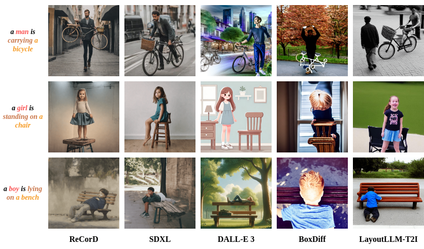

<div align="center">
<h1>ReCorD (ACM MM 2024)</h1>
<h3>ReCorD: Reasoning and Correcting Diffusion for HOI Generation</h3>

Jian-Yu Jiang-Lin<sup>1,2*</sup>&nbsp; Kang-Yang Huang<sup>2*</sup>&nbsp; Ling Lo<sup>1</sup>&nbsp; Yi-Ning Huang<sup>1</sup>&nbsp; 
<br>Terence Lin<sup>1</sup>&nbsp; Jhih-Ciang Wu<sup>2</sup>&nbsp; Hong-Han Shuai<sup>1</sup>&nbsp; Wen-Huang Cheng<sup>2</sup>

<sup>1</sup> National Yang Ming Chiao Tung University&nbsp; <sup>2</sup> National Taiwan University

[](https://arxiv.org/abs/2407.17911)&nbsp; [](https://alberthkyhky.github.io/ReCorD/)

</div>




**Overview**: ReCorD revolutionizes image generation by integrating LDM with VLMs. This training-free approach enhances the creation of multimedia content, particularly in accurately depicting HOIs.

---
### Installation
```
conda create -n ReCorD python=3.10.13 -y
conda activate ReCorD
pip install -r requirements.txt
```

### Usage
Execute the script to generate the example within the script. You can adjust the prompts and other configurations in the main.py script to customize your image generation.

```bash
python main.py
```
### Configuration
Here’s a brief overview of key configuration options:

- **prompt**: text prompts for generating images.
- **guidance_scale**: Controls the specificity of the image to the prompt (higher values generate more specific images).
- **n_inference_steps**: Number of steps for the model's inference, affecting the clarity and detail of the output.
- **run_standard_sd**: Boolean to choose between standard and custom Stable Diffusion runs.
- **scale_factor**: Affects the resolution or quality of generated images.
- **max_iter_to_alter**: Maximum iterations to modify attention for specified indices.
- **output_path**: File path where generated images will be stored.
- **viz_path**: Path for saving attention maps.

You can modify these settings in the `main.py` script to fit your specific requirements:

```python
config = RunConfig(
    prompt=['a boy is feeding', 'a boy is feeding a bird'],
    guidance_scale=7.5,
    n_inference_steps=50,
    run_standard_sd=False,
    scale_factor=20,
    max_iter_to_alter=25,
    output_path=Path('./outputs'),
    viz_path=Path('./attention_maps')
)
```

**Run Interaction-aware Reasoning Module**
```
python ./GPT4V/gpt4v.py
```

### interaction_aware_reasoning(generated_image_path, api_key, input_annotations=None)

* **generated_image_path:** The path of the generated image.
* **api_key:** API key for accessing the GPT4V.
* **input_annotations:** Input annotations for the GPT4V query.

input_annotations: should be a dictionay with the following format:
```
{
    "object": "motorcycle",
    "verb": "ride",
    "human_bboxes": "[169, 20, 349, 379]",
    "object_bboxes": "[60, 121, 465, 421]"
}
```

### Acknowledgment 

This project builds upon and is deeply influenced by the following repositories:
* [diffusers](https://github.com/huggingface/diffusers)
* [google](https://github.com/google/prompt-to-prompt)
* [boxdiff](https://github.com/showlab/BoxDiff)
* [yuval-alaluf](https://github.com/yuval-alaluf)

We are grateful to these outstanding open-source projects for providing the groundwork that made this project possible.
